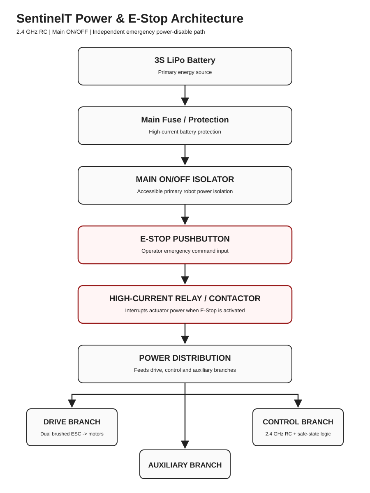

# SentinelT Power, Control and Emergency-Stop Architecture

**Build:** SentinelT  
**Category:** Robo Wars - RC Combat  
**Project Developer:** TG Assegaai

## Annotated Circuit / Power Schematic



The schematic explicitly shows both mandatory safety functions: the accessible **MAIN ON/OFF isolator** and the **E-STOP**. The E-Stop is implemented in a low-current normally-closed control loop that commands a separate high-current contactor/relay stage.

## High-Current Power Path

```text
3S LiPo Battery
    -> Main Fuse / Protection
    -> Accessible MAIN ON/OFF Isolator
    -> K1/K2 High-Current Contactor / Relay Contacts
    -> Power Distribution
         -> Drive Branch
         -> Weapon / Auxiliary Branch
         -> Control Branch
```

The mushroom E-Stop pushbutton is **not** placed in series with the full traction/weapon current. Its role is to interrupt the low-current control circuit that keeps the high-current isolation device energized.

## Low-Current E-Stop Control Loop

```text
Post-isolator low-current protected feed
    -> Normally-Closed E-STOP contact
    -> Safety / enable / watchdog logic
    -> K1/K2 contactor coil
```

### E-Stop action

When the E-Stop is pressed:

1. the normally-closed E-Stop contact opens;
2. the K1/K2 contactor coil de-energizes;
3. the high-current contactor/relay contacts open;
4. drive and weapon/auxiliary actuator power is removed;
5. software also returns SentinelT to its disabled/safe state;
6. normal operation resumes only after the safety condition is cleared and the robot is deliberately re-enabled.

This arrangement means a software fault cannot by itself bypass the hardware emergency power-disable path.

## Main ON/OFF Switch

SentinelT includes a separate, clearly accessible main ON/OFF isolation function. The final physical switch/disconnect will be selected with a DC rating appropriate to the installed battery and actuator current. Switching OFF removes actuator power before servicing, inspection or battery disconnection.

## 2.4 GHz RC and Failsafe Layer

SentinelT is human-operated using a **2.4 GHz RC link**. The receiver feeds command data to the control logic. Invalid/stale RC data, startup/reset, E-Stop activation or invalid commands force the software to a disabled state. This software safety layer supplements the hardware E-Stop and does not replace it.

## Physical Hardware Implementation

The physical SentinelT build will follow the same electrical architecture and Robo Wars safety constraints documented here. During hardware implementation the following will be measured, selected or verified before operation:

- final main and branch fuse ratings;
- DC rating of the main ON/OFF isolator;
- continuous/interruption rating of K1/K2 contactor/relay hardware;
- conductor gauge, connectors, insulation and strain relief;
- receiver failsafe configuration;
- measured current draw and voltage behavior;
- E-Stop power-interruption performance;
- deliberate restart/re-enable behavior after an E-Stop event.

These hardware-dependent checks are not claimed as already measured. The implementation procedure is to preserve the verified digital design intent and remain within the applicable Robo Wars limits when the physical robot is fabricated.

## Robo Wars Safety Mapping

| Requirement | SentinelT implementation |
|---|---|
| Main ON/OFF switch | Dedicated accessible battery-isolation function |
| Emergency Stop | Normally-closed E-Stop control loop de-energizing a separate high-current contactor/relay |
| RC frequency | Human-operated 2.4 GHz RC |
| RC signal loss | Software safe-state / actuator-command disable |
| Active mechanism safety | Separate power/control branch downstream of the isolation stage |
| Projectiles | Not used |
| Flames | Not used |
| Liquids | Not used |
