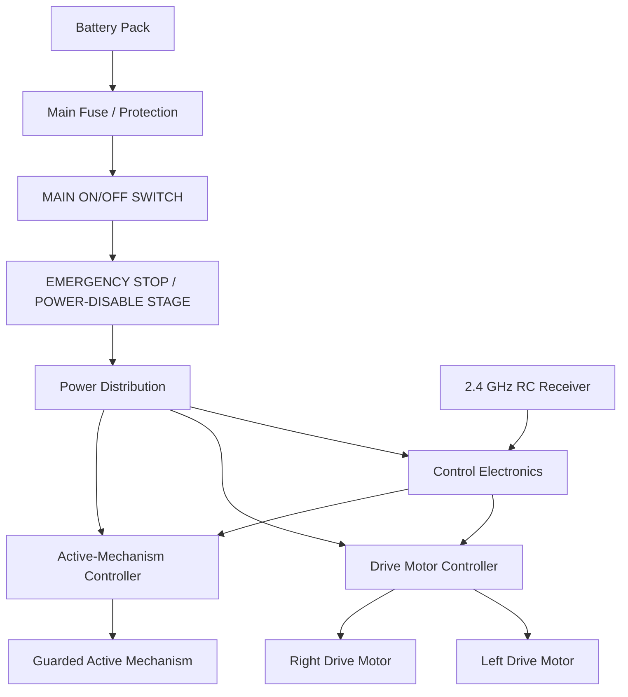
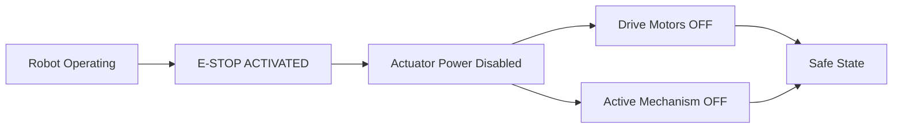
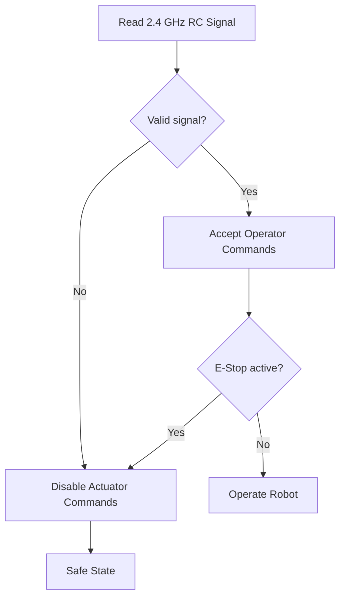

# SentinelT Power, Control and Emergency-Stop Architecture

**Project:** SentinelT Robo  
**Category:** Robo Wars - RC Combat  
**Designer:** Thato Glen Assegaai

## Safety Objective

SentinelT is designed with two separate operator-accessible safety functions:

1. **MAIN ON/OFF SWITCH**
2. **EMERGENCY STOP (E-STOP)**

The E-Stop is intended to disable actuator power immediately and must not depend only on normal software commands.

## Power Architecture

## Main ON/OFF Switch

The main ON/OFF switch provides primary electrical isolation for the robot.

**Design requirements:**
- clearly labelled;
- easily accessible without chassis disassembly;
- electrically rated for the final battery/load path or used to command a properly rated disconnect device;
- OFF state removes actuator power from the robot.

## Emergency Stop

The E-Stop is a dedicated safety mechanism intended to bring the actuator system into a safe state immediately.

When activated:
- drive actuation is disabled;
- active-mechanism actuation is disabled;
- the robot enters a safe state;
- normal operation cannot resume until the safety condition has been cleared and the system is intentionally re-enabled.

> **Implementation note:** the exact E-Stop switch/contact or contactor rating will be selected only after the final battery voltage and peak actuator current are known. A low-current mushroom switch must not be assumed to directly interrupt the full traction/weapon current unless its DC load rating is verified.

## RC Signal Safety

SentinelT uses a **2.4 GHz remote-control system**. Loss of a valid RC signal is treated as a safety event.

## Startup Safety Sequence

1. Confirm robot is mechanically safe and restrained where required.
2. Confirm the active mechanism is disabled.
3. Confirm the E-Stop is in the required safe/start condition.
4. Switch the 2.4 GHz transmitter ON.
5. Switch SentinelT main power ON.
6. Verify a valid RC link.
7. Verify low-command drive response.
8. Enable auxiliary actuation only when permitted and safe.

## Shutdown Sequence

1. Disable auxiliary actuation.
2. Stop all drive motion.
3. Activate isolation/E-Stop where required.
4. Switch main robot power OFF.
5. Disconnect the battery before servicing.

## Competition Safety Mapping

| Requirement | SentinelT Implementation |
|---|---|
| Main ON/OFF switch | Dedicated accessible power-isolation function |
| Emergency Stop | Dedicated actuator-power-disable function |
| RC frequency | 2.4 GHz |
| RC signal loss | Safe-state / actuator-disable response |
| Active mechanism safety | Separate enable/control path |
| Projectiles | Not used |
| Flames | Not used |
| Liquids | Not used |

## Final Physical Verification Required

Before fabrication/competition use, this document must be updated with the exact:
- battery specification;
- fuse rating;
- switch/disconnect rating;
- E-Stop component and DC interruption method;
- motor-controller ratings;
- wire gauges and connectors;
- 2.4 GHz receiver model;
- drive motors and auxiliary actuator.

All high-current component ratings must be verified against measured or manufacturer-specified loads before physical operation.
