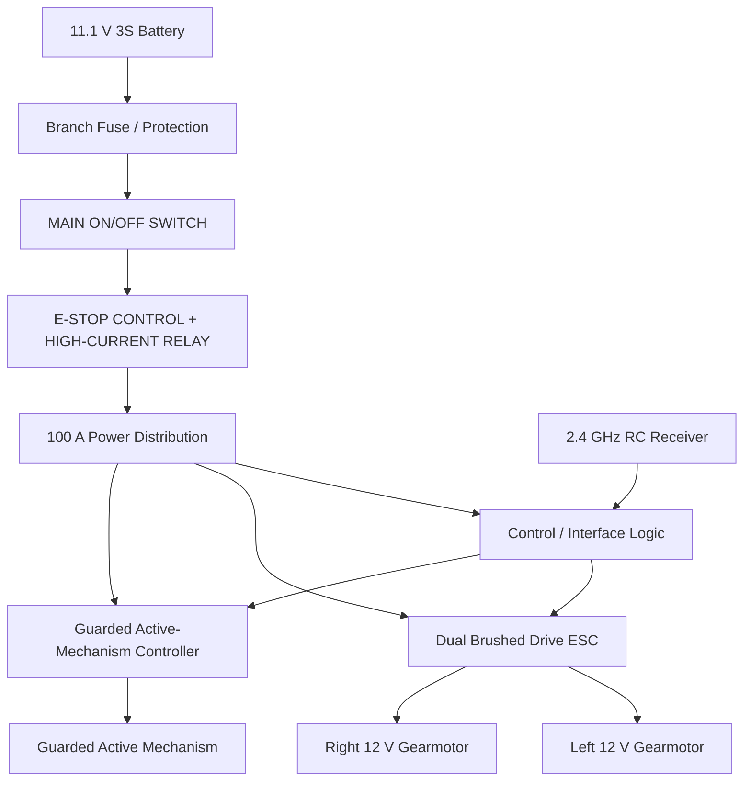
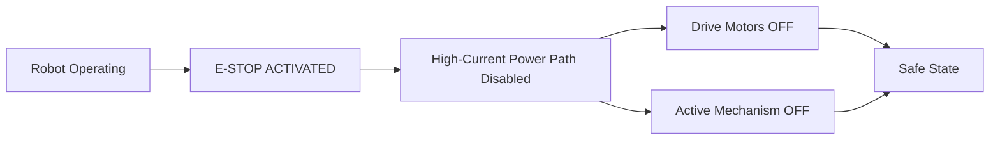
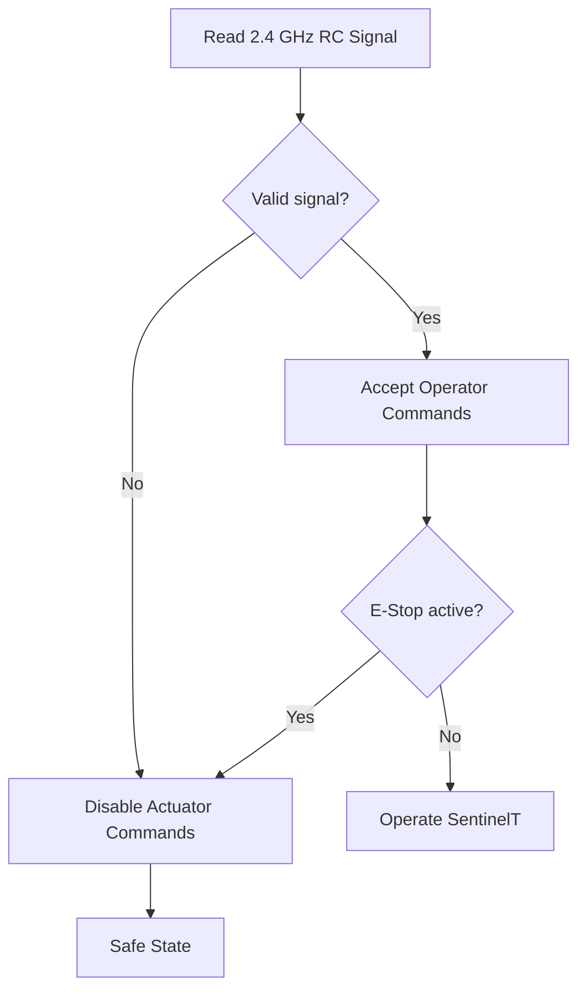

# SentinelT Power, Control and Emergency-Stop Architecture

**Project:** SentinelT  
**Category:** Robo Wars - RC Combat  
**Designer:** Thato Glen Assegaai

## Safety Objective

I designed SentinelT with two separate operator-accessible safety functions:

1. **MAIN ON/OFF SWITCH**
2. **EMERGENCY STOP (E-STOP)**

The E-Stop is intended to disable actuator power immediately and does not depend only on ordinary software commands.

## Power Architecture

## Main ON/OFF Switch

The main ON/OFF switch provides primary electrical isolation for SentinelT.

**Design requirements:**

- clearly labelled;
- easily accessible without chassis disassembly;
- electrically rated for the final DC load path, or used to command a correctly rated disconnect device;
- OFF state removes actuator power from the robot.

## Emergency Stop

The E-Stop is a dedicated safety mechanism intended to bring the actuator system into a safe state immediately.

When activated:

- drive actuation is disabled;
- active-mechanism actuation is disabled;
- SentinelT enters a safe state;
- ordinary operation cannot resume until the safety condition is cleared and the system is intentionally re-enabled.

> **Implementation note:** the mushroom-style E-Stop pushbutton is not assumed to interrupt full traction/auxiliary current directly. The current design uses it to control a separate high-current relay/contactor candidate. Final DC interruption ratings will be verified against the completed load system.

## RC Signal Safety

SentinelT uses a **2.4 GHz remote-control system**. Loss of a valid RC signal is treated as a safety event.

## Startup Safety Sequence

1. Confirm the robot is mechanically safe and restrained where required.
2. Confirm the guarded active mechanism is disabled.
3. Confirm the E-Stop is in the required safe/start condition.
4. Switch the 2.4 GHz transmitter ON.
5. Switch SentinelT main power ON.
6. Verify a valid RC link.
7. Verify low-command drive response.
8. Enable auxiliary actuation only when permitted and safe.

## Shutdown Sequence

1. Disable auxiliary actuation.
2. Stop all drive motion.
3. Activate isolation/E-Stop where required.
4. Switch main robot power OFF.
5. Disconnect the battery before servicing.

## Robo Wars Safety Mapping

| Requirement | SentinelT Implementation |
|---|---|
| Main ON/OFF switch | Dedicated accessible power-isolation function |
| Emergency Stop | Dedicated actuator-power-disable function |
| RC frequency | 2.4 GHz |
| RC signal loss | Safe-state / actuator-disable response |
| Active mechanism safety | Separate enable/control path |
| Projectiles | Not used |
| Flames | Not used |
| Liquids | Not used |

## Final Physical Verification

Before physical operation, I will lock and verify the exact:

- final active-mechanism motor/controller;
- final main/branch protection ratings;
- switch/disconnect and relay/contactor ratings;
- wiring terminations and routing;
- receiver failsafe configuration;
- actual current draw and actuator loads;
- physical E-Stop interruption performance.

All high-current ratings will be verified against measured or manufacturer-specified loads before the completed robot is operated.
