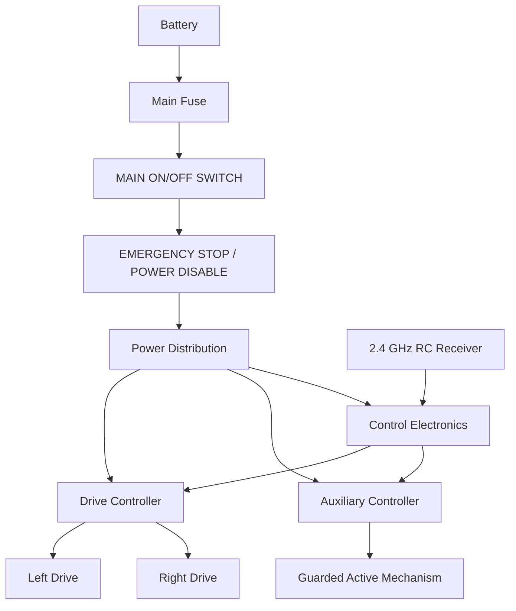

# SentinelT Robo Wars Combat Robot - Holistic Build Document

**Designer:** Thato Glen Assegaai  
**Category:** Robo Wars - RC Combat  
**Competition:** Robo Rumble 2026 - Elimination Round

## 1. Context and Competition Constraints

SentinelT is designed for the Robo Rumble Robo Wars category. The elimination rules require a maximum **500 mm x 500 mm footprint**, a physical mass **strictly below 5 kg**, human-operated **2.4 GHz RC** control, an accessible main ON/OFF switch, and an Emergency Stop mechanism capable of rapidly disabling the robot. Projectiles, flames and liquids are not part of this design.

The engineering challenge is to combine compact packaging, mobility, protection, serviceability and safe control while remaining inside these constraints.

## 2. Solution Overview

SentinelT is a compact RC combat-robot CAD concept featuring:

- armored mobile chassis;
- protected wheel/drive areas;
- sloped frontal and side protection;
- articulated upper structure;
- removable/serviceable covers;
- 2.4 GHz human-operated RC architecture;
- dedicated ON/OFF and E-Stop safety architecture;
- guarded active-mechanism provision.

## 3. Verified CAD Compliance

The final Blender model was audited with custom Python scripts using world-space mesh bounds.

| Parameter | Verified CAD Result |
|---|---:|
| Width (X) | **318.16 mm** |
| Length (Y) | **495.00 mm** |
| Height (Z) | **255.41 mm** |
| Maximum footprint allowed | 500 x 500 mm |
| Frames checked | 180 |
| Failed frames | **0** |
| Footprint status | **PASS** |

The audit checks the visible mesh geometry across frames 1-180. Earlier versions exceeded the footprint; the final model was repackaged and re-audited until all checked frames passed.

## 4. Mechanical Design

### 4.1 Chassis

The lower chassis is the main structural and mobility platform. It contains the drive layout, protected wheel areas, sloped guards, central service volume, top cover and mounting provision for the upper structure.

### 4.2 Protection

External surfaces use a mixture of enclosed body panels, wheel shields and sloped guards. The intent is to reduce direct exposure of the drivetrain and electronics while keeping the design compact.

### 4.3 Upper Structure

The upper body contains the torso, shoulder housings, articulated arms, forearms, hands and helmet structure. Articulation was specifically included in the footprint audit because moving geometry can violate size limits even when a neutral pose is compliant.

### 4.4 Fabrication Approach

The current submission is a detailed CAD and engineering concept. Planned fabrication methods include machined or laser-cut structural plate, bent sheet-metal panels, bolted joints, replaceable guards and 3D-printed non-critical covers where appropriate. Final materials and thicknesses will only be fixed after mass, strength and supplier checks.

## 5. Mechanical Evidence

Final CAD and renders are stored in:

- `Designs/Mechanical_Design/CAD/`
- `Designs/Mechanical_Design/Renders/`

The render set includes front, side, top and isometric views.

## 6. Engineering Mass Budget

Blender geometry does not provide a trustworthy physical mass because material density and final fabricated thicknesses are not yet validated. A subsystem design allocation is therefore used instead of claiming a false measured mass.

| Subsystem | Planned Mass |
|---|---:|
| Chassis and lower armor | 1.10 kg |
| Drive motors and gearboxes | 0.75 kg |
| Wheels, hubs and shafts | 0.30 kg |
| Battery and power system | 0.60 kg |
| RC electronics, ESCs and wiring | 0.25 kg |
| Guarded active mechanism + drive/mount | 0.70 kg |
| Upper structure, arms and outer shells | 0.50 kg |
| Bearings, brackets and fasteners | 0.25 kg |
| Contingency allowance | 0.20 kg |
| **TOTAL** | **4.65 kg** |

**Design margin to 5.000 kg: 0.350 kg.**

> The 4.650 kg value is an engineering estimate. The completed physical robot must be weighed on a calibrated scale before competition.

## 7. Electronic Design

The proposed electrical architecture is:

Exact ratings and part numbers will be finalized after component procurement and load verification.

## 8. Safety: ON/OFF and E-Stop

The main ON/OFF switch provides accessible primary isolation. The E-Stop is a separate safety function intended to disable actuator power immediately. The E-Stop must not rely only on normal software commands.

The detailed safety architecture is documented in `Designs/Schematics/SentinelT_Power_and_EStop.md`.

The final physical implementation must verify that the switch, disconnect device, fuse, connectors and wiring are correctly rated for the actual DC load.

## 9. 2.4 GHz RC Control

SentinelT is human-operated using a 2.4 GHz RC link. The operator controls forward/reverse motion, steering, stop and a dedicated auxiliary-enable function. The robot is not autonomous.

The software defaults to a disabled state on startup, reset, invalid command data, E-Stop activation or loss of the RC signal.

## 10. Programming and Framework Design

The control loop follows this sequence:

1. initialize the controller;
2. force outputs to disabled;
3. verify E-Stop status;
4. initialize/read the 2.4 GHz receiver;
5. reject invalid or timed-out RC data;
6. read throttle/steering commands;
7. apply differential-drive mixing;
8. keep auxiliary actuation disabled unless deliberately enabled;
9. continuously return to a safe state on E-Stop or signal loss.

Flowcharts and firmware skeletons are stored under `Source_Code/`.

## 11. Simulation and Digital Testing

Blender and Python were used for repeatable dimensional verification. The final footprint result is **PASS across all 180 checked frames**. This provides simulation/digital-testing evidence for the elimination submission, while physical testing remains required before competition operation.

## 12. Bill of Materials Summary

The full spreadsheet is stored at `Documentation/BOM/SentinelT_Bill_of_Materials.xlsx` and includes the required fields for component name, quantity, unit cost, supplier, stock code, purchase URL and total cost.

Because no components are currently owned, procurement begins from zero. Unverified prices/stock codes are not presented as confirmed values; TBD fields must be replaced with verified supplier information before final procurement.

## 13. Serviceability

The design includes a removable-cover concept and modular assemblies so the battery, receiver, motor controllers, power wiring and drive components can be inspected without dismantling the entire robot.

## 14. Limitations and Physical Verification Required

The current submission is a CAD and engineering concept. The following remain to be physically verified:

- actual completed mass;
- final material thicknesses;
- drivetrain torque/speed and current draw;
- battery runtime and temperature;
- RC range and failsafe behaviour;
- E-Stop electrical interruption performance;
- structural durability;
- fastener retention;
- arena performance.

These limitations are documented intentionally rather than represented as completed tests.

## 15. Individual Role

Thato Glen Assegaai is the individual designer and is responsible for concept development, CAD modelling, mechanical architecture, Blender scripting/auditing, control-system design, safety architecture, documentation and repository management.

## 16. Conclusion

SentinelT is a competition-focused Robo Wars CAD concept designed around the elimination-round constraints. The final CAD footprint of **318.16 mm x 495.00 mm** complies with the 500 mm x 500 mm limit across **180/180 checked frames**. The engineering mass allocation is **4.650 kg**, leaving a **0.350 kg** design margin below 5 kg, subject to final physical weighing.

The repository also documents the required 2.4 GHz RC architecture, main ON/OFF isolation, Emergency Stop provision, safe-state software logic, mechanical CAD evidence and simulation/audit workflow. The next phase is final component procurement, schematic rating verification, fabrication and controlled physical testing.
