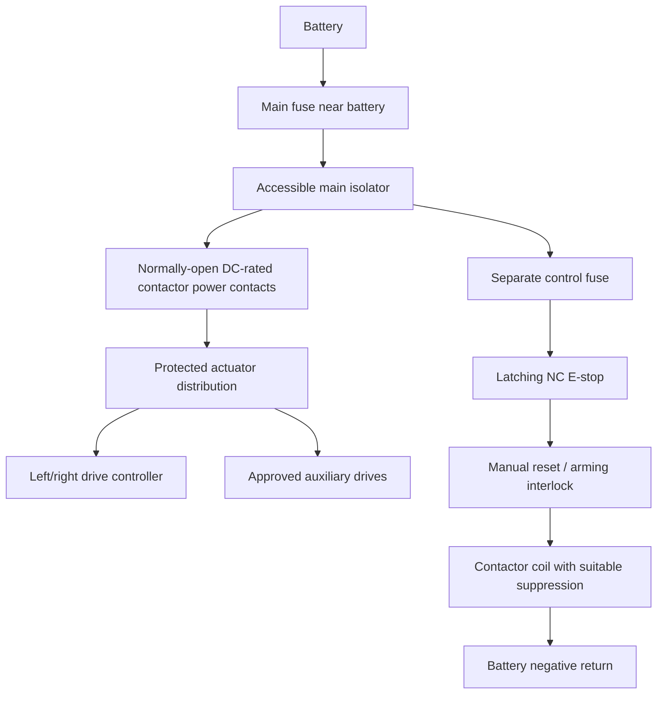

# Electronics and isolation review

This is a design review and commissioning checklist, not finalized pin-level wiring or a passed physical test. Retain the submitted four-motor / MDD20A / Pico 2W concept pending stock and compatibility decisions.

## Items to resolve

| Item | Finding | Required action |
|---|---|---|
| MDD20A | Two brushed channels with PWM/direction control; not a direct plug-in RC servo ESC. Supplier lists no stock. | Confirm lead time and current needs; implement receiver-to-controller command interface. |
| Pico 2W | Submitted firmware still has placeholder receiver reads and output functions. Board stock unavailable on checked page. | Confirm board first, then specify pins, logic levels, arming, fresh-packet timeout and watchdog. |
| ER4 / Boxer | Select 2.4 GHz ELRS transmitter variant. ER4 has four PWM outputs and manufacturer documents serial output options. | Define enough logical channels for throttle, steer, arm and mechanisms. Verify exact firmware/output mode and failsafe behavior; do not assume held PWM means a healthy radio link. |
| ST3215 servos | Manufacturer specifies 6-12.6 V input and TTL serial bus; they are not conventional PWM servos. | Validate adapter/UART wiring, connector current and peak demand. Servo torque is not an impact-load rating. Do not run from the small 5 V logic supply. |
| FIT0156 | Supplier page calls the operator momentary; latching/NC behavior not established. No stock shown. | Obtain documented latching NC device/contact details and verify with meter before wiring the safety loop. |
| Relay / isolator | Current labels alone do not establish DC fault interruption or safe restart. | Confirm contact DC rating, coil voltage, suppression and manual reset arrangement with the lab. |
| Regulator | CHR-624-2A has USB output; supplier descriptions differ between nominal 2 A and max 3 A. | Design to confirmed rating, secure connections, protect logic and verify supply under load. |
| Protection | Submitted BOM has one main fuse holder; branch protection, terminals and suppression/reset parts are not fully specified. | Complete circuit and harness list before power-up. |

## Functional power architecture

The E-stop pushbutton belongs in the low-current coil circuit. It must not carry the combined motor current. Main OFF must isolate the intended supply. Pressing E-stop must remove actuator power independently of firmware; release or power restoration must not cause automatic motion. Prevent backfeed from logic, signals, USB or auxiliary power. Power interruption does not establish instantaneous mechanical stopping; record coast-down separately.

## Commissioning approach

Use lab-reviewed wiring and procedures. Begin unpowered, then use current-limited logic checks and outputs observed without moving mechanisms. For drive tests, secure the chassis and keep active mechanisms electrically isolated. Only proceed to an approved test area after isolation, failsafe and restart checks pass. Do not deliberately stall motors or short batteries to test a rating.

Record actual voltages, currents, temperatures and timing with instrument/model references. Proposed timeout values are not measured receiver-loss times. Changes to radio mode, firmware, wiring, battery, actuator or protection require affected tests to be repeated.

## Primary references checked 21 September 2026

- [ST3215 manufacturer specification](https://www.waveshare.com/wiki/ST3215_Servo)
- [ER4 manufacturer specification](https://www.radiomasterrc.com/products/er4-2-4ghz-elrs-pwm-receiver)
- [RadioMaster receiver configuration guide](https://radiomasterrc.freshdesk.com/support/solutions/articles/64000308559-expresslrs-pwm-receiver-setup-and-configuration-guide)
- [MDD20A supplier page and linked manufacturer documents](https://www.robotics.org.za/MDD20A)
- [E-stop candidate listing](https://www.robotics.org.za/FIT0156)
- [Serial-bus adapter listing](https://www.robotics.org.za/motors-controllers/W25514)

## Proposed finals substitutions

The current request uses a ready-made FlySky FS-i6X/iA6B bundle, a Pico W (RP2040) and Communica PBME25TRP-L12-65 E-stop candidate. The table above records baseline findings. Retarget firmware for the actual board; use an appropriate receiver interface and confirm logic levels. The FlySky receiver cannot drive motors directly, and its AFHDS 2A radio protocol is not compatible with the ER4 ELRS receiver. Both pieces of the matched bundle must be used together. Six channels require a deliberate allocation for drive, arm and mechanisms; serial i-BUS, channel availability and failsafe behavior must be verified on the supplied units. No custom transmitter is needed.
