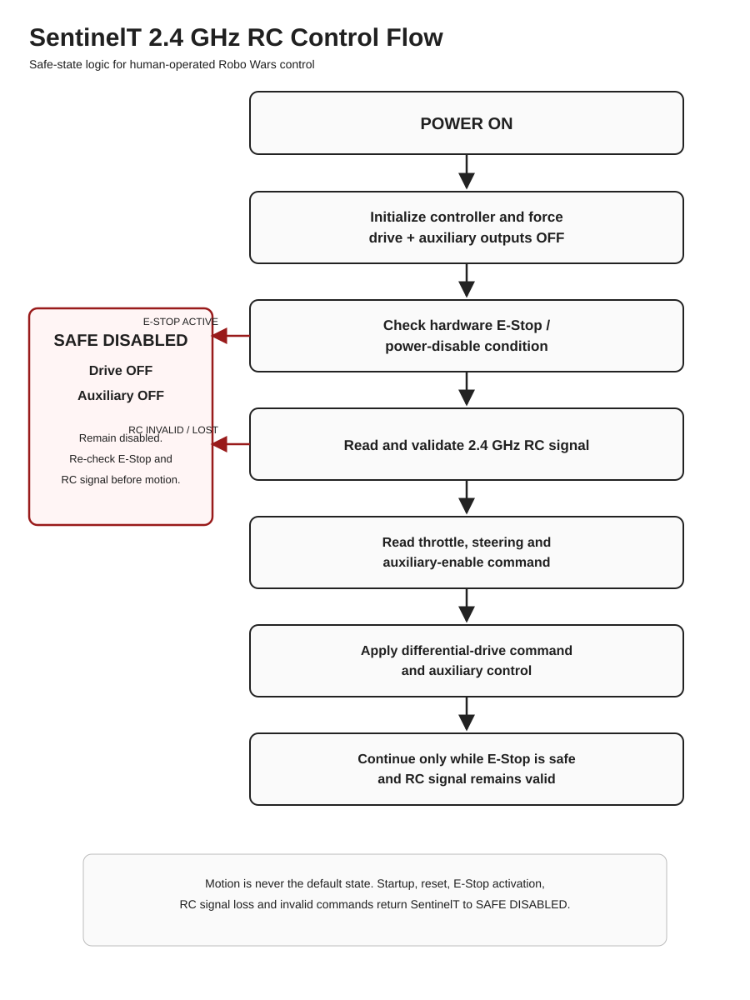
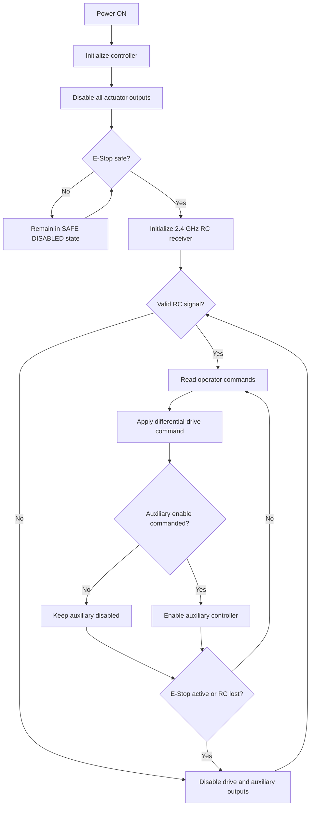

# SentinelT Control Flowcharts

The primary control-flow diagram is available as a clear, scalable vector graphic:

## Main Operating Logic

## Safety Principle

The software never treats motion as the default state. Startup, reset, signal loss and invalid command data all return SentinelT to a disabled state. The physical E-Stop remains a separate hardware safety layer.
